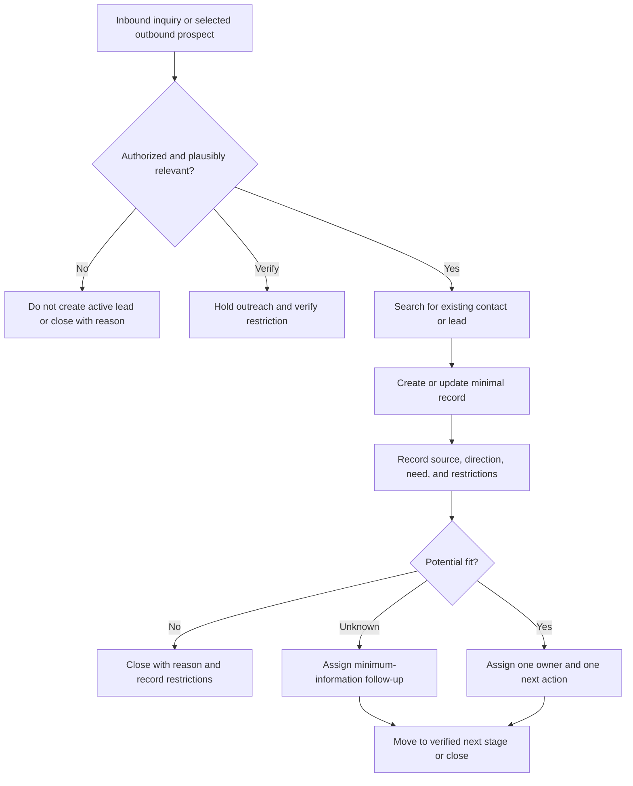

# Lead Intake — Elon Algorithm Review

## Executive Recommendations

1. **Reject “anyone you can contact” as the operating definition of a lead.** It is too broad to guide action and could classify an entire address book as business inventory. Use a narrower, testable definition tied to plausible fit, contactability, and an authorized next action.
2. **Do not use the four categories as the process itself.** Warm/cold and one-to-one/one-to-many are useful independent attributes, but they mix relationship, outreach method, and acquisition channel.
3. **Separate the concepts without creating three bureaucratic processes.** Marketing creates demand, advertising is paid distribution, and lead intake begins when a contactable prospect enters the operating workflow. Create separate campaign procedures only when recurring campaign work actually needs them.
4. **Do not import or contact everyone in a personal phone list by default.** Treat that as a proposed source requiring relevance, consent, privacy, brand, and do-not-contact verification.
5. **Use one minimal lead-intake path with two triggers:** an inbound inquiry or an intentionally selected outbound prospect. Capture only information needed to assign the next action or close the record.
6. **Do not automate yet.** No actual current-state workflow, system, volume, conversion baseline, response time, or failure rate was supplied. First run and measure the simplest manual process.

## 1. Outcome and Scope

- **Customer:** Prospective external customer
- **Proposed outcome:** Give each legitimate prospective customer one clear, owned next action without duplicate records, unnecessary data collection, or unauthorized outreach.
- **Proposed trigger:** An inbound inquiry arrives, or an operator intentionally selects a plausible outbound prospect for authorized contact.
- **Proposed terminal state:** The lead has an assigned next action and owner, or is closed with a reason and any contact restriction recorded.
- **In scope:** Entry into the lead workflow, minimal capture, duplicate check, initial fit decision, ownership, and next action.
- **Out of scope:** Campaign design, ad purchasing, content creation, detailed assessment, estimating, and production.
- **Owner:** Unknown; must be assigned before approval.

## 2. Transcript Extraction

| ID | Type | Extracted statement | Assessment |
|---|---|---|---|
| E-001 | REQUIREMENT | A lead is anyone the business can contact. | Attributed to an external framework but operationally too broad; challenge and rewrite. |
| E-002 | PROPOSAL | Organize leads as warm one-to-one, warm one-to-many, cold one-to-one, and cold one-to-many. | Useful as a two-axis analytical model, not as a complete process or source taxonomy. |
| E-003 | EXAMPLE | A phone contact is a warm one-to-one lead. | Relationship may be warm, but presence in a phone does not establish business relevance or permission. |
| E-004 | EXAMPLE | Existing-customer blast email is warm one-to-many. | May be retention or `08 Max LTV`, not new-lead intake; depends on campaign outcome. |
| E-005 | ASSUMPTION | Cold one-to-one may be less applicable to a service business. | Unverified; test based on economics, fit, brand, and lawful outreach rather than assumption. |
| E-006 | EXAMPLE | Door-to-door outreach is cold one-to-one. | Plausible channel/mode classification; not itself a lead record until a prospect is selected or responds. |
| E-007 | EXAMPLE | Google Local Services, Facebook Ads, Nextdoor, door hangers, and EDDM are cold one-to-many. | These are acquisition channels or campaigns. Their audience is not automatically a set of leads. |
| E-008 | UNKNOWN | Whether advertising, marketing, and leads require separate processes. | Recommend conceptual separation now; create additional processes only for recurring operational work. |
| E-009 | POSSIBLE TRANSCRIPTION ERROR | “Alex Hermosy” and “100 Million Dollar Leads.” | Likely refers to Alex Hormozi and `$100M Leads`; verify if attribution matters. |

## 3. Current-State Summary

The transcript describes a conceptual classification of lead-generation approaches. It does **not** establish the actual current lead-intake workflow.

Unknown current-state facts include:

- Where inquiries arrive
- Who sees them first
- Which system stores them
- Whether duplicate records occur
- What information is required
- How initial fit is assessed
- What the next lifecycle stage is
- Who owns follow-up
- How quickly contact occurs
- How opt-outs and contact restrictions are handled
- Where leads are lost
- Current volume, conversion, cost, cycle time, or error rates

Because these facts are absent, no current-state cycle-time or bottleneck claim can be treated as measured.

## 4. Make Requirements Less Dumb

| ID | Original requirement or assumption | Accountable owner | Source/evidence | Protected outcome | Smallest valid form | Decision |
|---|---|---|---|---|---|---|
| R-001 | Anyone contactable is a lead. | Unassigned | External framework cited; no operational evidence | Maintain a large prospect pool | A lead is a contactable person or organization with plausible service fit and an authorized, owned next action. | CHALLENGE / REWRITE |
| R-002 | All leads must fit one of four warm/cold and one-to-one/one-to-many categories. | Unassigned | Conceptual model only | Understand acquisition motion | Store relationship temperature and interaction scale only when they support a decision or useful analysis. | COMBINE |
| R-003 | Personal phone contacts should be used as warm leads. | Unassigned | Example only | Start outreach quickly | Select only relevant contacts for whom outreach is appropriate and permitted; do not bulk-import by default. | VERIFY BEFORE REMOVAL |
| R-004 | Advertising, marketing, and leads need separate processes. | Unassigned | No evidence | Clarify ownership and work | Keep definitions separate; create a process only for recurring work with a distinct trigger, outcome, and owner. | DELETE AS CURRENT REQUIREMENT |
| R-005 | Each legitimate lead needs a next action or closure decision. | Unassigned | Proposed operating control | Prevent dropped inquiries and ambiguous ownership | Record one owner and one next action, or close with a reason. | RETAIN, OWNER REQUIRED |
| R-006 | Contact restrictions must be respected. | Unassigned | Exact legal and policy sources not provided | Protect privacy, trust, and compliance | Check and record applicable permission, opt-out, and do-not-contact constraints before outreach. | VERIFY BEFORE REMOVAL |

## 5. Delete

| Element | Decision | Rationale | Validation or add-back trigger |
|---|---|---|---|
| “Everyone contactable” lead universe | DELETE | Creates noise without defining plausible fit or action. | Restore a broader prospect universe only if a measured sourcing use case requires it. |
| Mandatory single four-bucket taxonomy | DELETE | It conflates independent dimensions and channels. | Add attributes individually only when they drive routing or measured analysis. |
| Automatic import of all phone contacts | DELETE | Relevance, permission, privacy, and brand risk are unverified. | Permit a bounded, reviewed selection method after rules are verified. |
| Separate advertising process now | DELETE | No recurring workflow, owner, or output was supplied. | Create when campaign operation is actually documented. |
| Separate marketing process now | DELETE | Same reason; conceptual separation does not require procedural separation. | Create when recurring marketing work has a distinct outcome and owner. |
| Fields that do not drive a decision | DELETE | Unnecessary capture slows intake and decays. | Add only after demonstrating a downstream decision or reporting need. |

## 6. Simplify and Optimize

Use one lead-intake record with the smallest useful data set:

- Contact name or organization when known
- Usable contact method
- Date and time received or selected
- Acquisition source
- Inbound or outbound direction
- Brief stated or hypothesized service need
- Service-area or fit result when relevant
- Contact-permission or restriction status when applicable
- One owner
- One next action and due time, or one closure reason

Treat these as separate optional dimensions rather than one forced category:

- **Relationship:** warm, cold, or unknown
- **Interaction scale:** one-to-one or one-to-many campaign source
- **Source channel:** referral, existing customer, Google Local Services, Facebook, Nextdoor, direct mail, door-to-door, or other

Only retain a field if it changes action, ownership, compliance handling, or a metric someone uses.

## 7. Accelerate Cycle Time

No baseline is available. Begin by timestamping:

1. Inquiry received or prospect selected
2. Record created or matched
3. Owner assigned
4. First authorized contact attempt
5. Next-stage transition or closure

Measure before setting targets:

- Time to ownership
- Time to first authorized response
- Percentage with a next action
- Duplicate-record rate
- Lead aging
- Transition rate to the verified next stage
- Closure reasons by source

Attack waiting, unclear ownership, and duplicate capture before asking people to type faster.

## 8. Automate Last

### Rejected for now

- Bulk-importing phone contacts
- Automatically classifying every reachable person as a lead
- Automated outbound messaging
- Automated scoring or routing
- Automated campaign creation

### Candidates after validation

- Duplicate detection
- Source attribution from inbound channels
- Timestamp capture
- Owner notification
- Overdue-next-action alerts
- Opt-out suppression

Automate only after the minimal fields, routing decisions, exceptions, fallback, volume, and owner are stable.

## 9. Proposed Future State

The next lifecycle stage is not assumed despite the folder sequence; verify whether a qualified lead moves to `02 Offer`, `03 Assessment`, or another state.

## 10. Validation Plan

Run the proposed process manually for a defined pilot period before automation.

Record:

- Total records
- Source and direction
- Duplicate count
- Records lacking owner or next action
- Response timestamps
- Transition and closure outcomes
- Exceptions and missing fields

After the pilot, delete any field nobody used, revise ambiguous fit rules, and automate only stable high-volume work.

## 11. Open Verification Items

| Item | Why unresolved | Required owner or expert | Safe interim approach |
|---|---|---|---|
| Process owner | No owner named | Business owner | Keep status `proposed`; assign explicitly before approval. |
| System of record | No tool named | Process owner | Use one designated temporary location; do not duplicate lists. |
| Next lifecycle stage | Sequence not described | Sales/process owner | Record a generic next action until stage criteria are defined. |
| Contact permission and restrictions | Jurisdiction, channels, policies, and consent not supplied | Qualified legal/compliance owner | Do not bulk-message or import personal contacts; honor known opt-outs. |
| Qualification criteria | Service, geography, capacity, and economics absent | Business owner | Ask only the minimum needed to determine plausible fit. |
| Response target | No baseline or promise supplied | Process owner | Timestamp actual performance before committing to an SLA. |
| Source attribution | Book/author wording may contain a transcription error | Author | Verify only if the citation will remain in approved documentation. |

## 12. Scorecard

| Category | Score | Reason |
|---|---:|---|
| Outcome | 1 | Proposed but not confirmed by an owner. |
| Requirements | 1 | Requirements challenged; ownership and external sources unresolved. |
| Deletion | 2 | Explicit deletion pass completed. |
| Safety | 2 | Sensitive outreach constraints are flagged for verification. |
| Simplicity | 2 | Minimal record and one-path design proposed. |
| Flow | 1 | Timestamp plan exists; no baseline exists. |
| Automation | 2 | Premature automation rejected. |
| Execution | 1 | Draft procedure exists but system and next-stage rules are unknown. |
| Measurement | 1 | Definitions proposed; owners, baselines, and targets absent. |
| History | 2 | Decision log created. |

- **Score:** 15/20
- **Hard stops:** Process owner unassigned; binding outreach rules unverified; success baseline absent.
- **Disposition:** Useful proposed draft, not ready for approval or automation.
