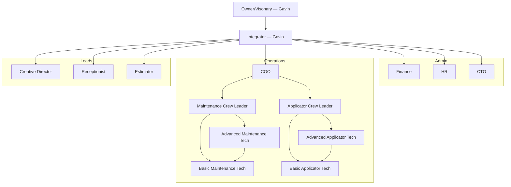

## Organization Chart

```mermaid
flowchart TD
    A["Owner/Visonary — Gavin"]
    B["Integrator — Gavin"]

    subgraph AA["Admin"]
        direction TB
        C1["Finance"]
        C2["HR"]
        C3["CTO"]

    end

    subgraph BB["Operations"]
        direction TB
        D1["COO"]
        D2["Maintenance Crew Leader"]
        D3["Applicator Crew Leader"]
        D4["Advanced Maintenance Tech"]
        D5["Basic Maintenance Tech"]
        D6["Advanced Applicator Tech"]
        D7["Basic Applicator Tech"]

        D1 --> D2
        D1 --> D3
        D2 --> D4
        D2 --> D5
        D4 --> D5
        D3 --> D6
        D3 --> D7
        D6 --> D7

    end

   subgraph CC["Leads"]
        direction TB
        E1["Creative Director"]
        E2["Receptionist"]
        E3["Estimator"]

    end


    A --> B
    B --> C1
    B --> C2
    B --> C3
    B --> D1
    B --> E1
    B --> E2
    B --> E3
```
