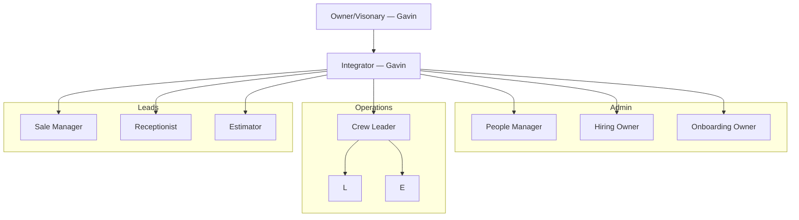

## Organization Chart

```mermaid
flowchart TD
    A["Owner/Visonary — Gavin"]
    B["Integrator — Gavin"]

    subgraph AA["Admin"]
        direction TB
        C1["People Manager"]
        C2["Hiring Owner"]
        C3["Onboarding Owner"]

    end

    subgraph BB["Operations"]
        direction TB
        D["Crew Leader"]
        l["L"]
        e["E"]

        D --> l
        D --> e

    end

   subgraph CC["Leads"]
        direction TB
        E1["Sale Manager"]
        E2["Receptionist"]
        E3["Estimator"]

    end


    A --> B
    B --> C1
    B --> C2
    B --> C3
    B --> D
    B --> E1
    B --> E2
    B --> E3
```
