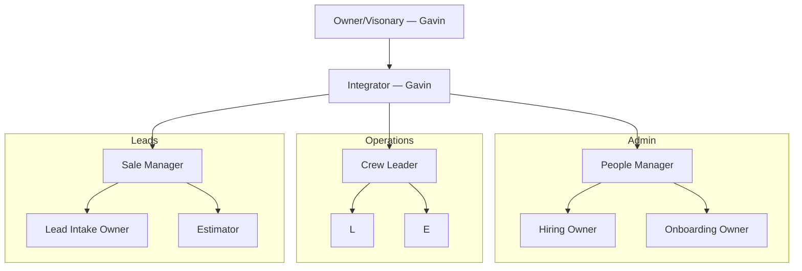

# Organization Chart

Edit the Mermaid block below to define the organization chart. Keep role names in square brackets and connect reporting or accountability relationships with arrows.

Example syntax, for reference:

```text
owner[Owner] --> role[Role Name]
```

## Chart


