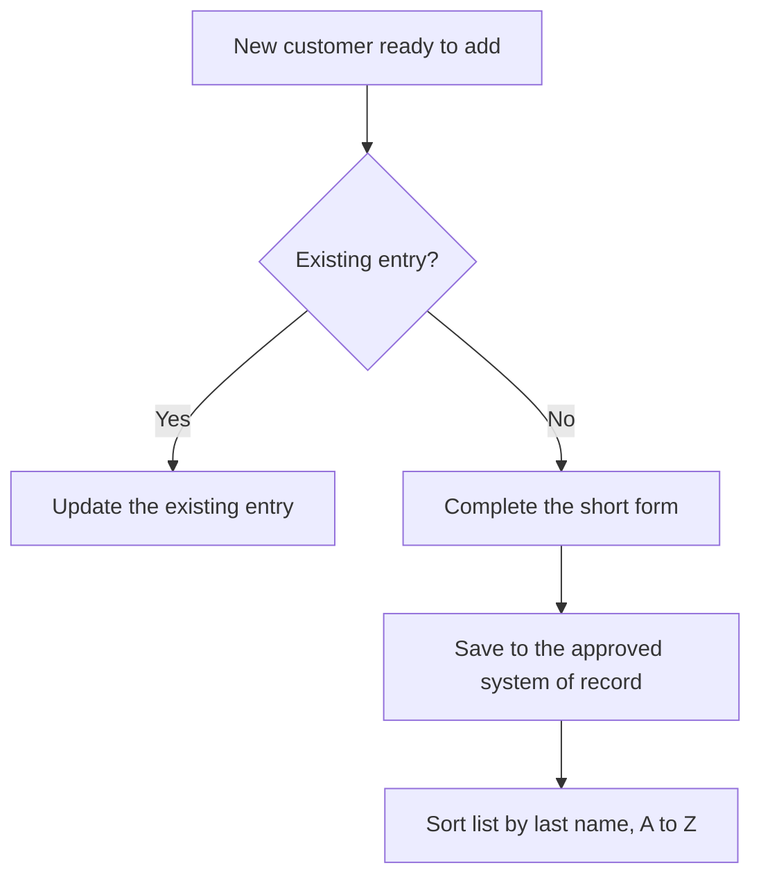

# Client Intake — Elon Algorithm Review

## Executive Recommendations

1. **Keep the record deliberately small.** The request already limits capture to
   name, phone, email, address, and notes. Resist adding fields that no downstream
   decision or metric consumes.
2. **Challenge the notes field.** It is the only open-ended input. Keep it only as a
   short, factual line about the customer; it is not a place for transcripts or
   service history.
3. **Do not publish real customer data.** The site publicizes all `TLC-OS/`
   documents. The browser form must stay local, and any durable client list needs an
   approved controlled system, not a public Markdown file.
4. **Name the system of record before storing data.** Without one, entries cannot be
   relied on, deduplicated, or protected.
5. **Do not automate yet.** There is no measured volume, error rate, or owner, so the
   first step is a consistent manual form and a sort rule.

## Outcome and Scope

- **Customer:** Office staff adding a client.
- **Outcome:** A single consistent entry per customer, comparable across customers.
- **Trigger:** A new customer is ready to add.
- **Terminal state:** The entry is saved in the system of record.
- **In scope:** One short form, fixed fields, last-name A-to-Z ordering.
- **Out of scope:** Assessment, estimating, production, service history.
- **Owner:** Unassigned; the organization chart has no named client-records seat.

## Requirement Register

| ID | Requirement | Disposition | Smallest justified form |
|---|---|---|---|
| R-001 | Capture every customer in one short form | RETAIN | One entry per customer with the five fixed fields. |
| R-002 | Fixed fields: name, phone, email, address, notes | RETAIN | Split name into first/last so last-name sort is deterministic. |
| R-003 | Notes field | RETAIN, BOUNDED | Short factual line only; no transcripts or open-ended essays. |
| R-004 | Organize entries by last name, A to Z | RETAIN | Sort by last name, then first name, case-insensitively. |
| R-005 | Publish client entries on the website | VERIFY BEFORE REMOVAL | Keep entries in a controlled system; do not commit personal data to a public repository. |
| R-006 | Durable system of record | UNKNOWN / BLOCKER | Select and approve a store before relying on entries. |

## Delete

| Element | Decision | Rationale | Add-back trigger |
|---|---|---|---|
| Long transcripts or open-ended forms | DELETE | The request explicitly excludes them; they break consistent formatting. | Restore only if a downstream decision requires narrative history. |
| Extra optional fields | DELETE | Unused fields slow intake and decay. | Add when a real decision or metric needs the field. |
| Public client list | VERIFY BEFORE REMOVAL | Privacy rule forbids needless identities in a public site. | Approved controlled storage plus a redaction policy. |

## Simplify

- One default path: fill the five fixed fields, save, confirm the sort order.
- One optional notes line, capped in intent to a short factual note.
- One ordering rule applied every time: last name A-to-Z, then first name.
- One review step: check for an existing entry before adding a duplicate.

## Accelerate

No baseline exists. Measure only if volume justifies it: entries added, duplicate
entries, missing-field rate, and time to add one entry. Do not set a target before a
baseline exists.

## Automate Last

Rejected for now: auto-importing contacts, automatic deduplication, and syncing to
an unnamed tool. Revisit after the store, owner, and volume are known.

## Proposed Future State

## Open Verification Items

| Item | Why unresolved | Required owner | Safe interim approach |
|---|---|---|---|
| System of record | Not supplied | Process owner | Use the browser form only; do not commit personal data. |
| Process owner | No seat named | Integrator | Keep entries unowned and the SOP `proposed`. |
| Notes scope | "Notes" is open-ended | Process owner | Allow one short factual line; no transcripts. |
| Retention and privacy | No obligation supplied | Qualified compliance owner | Store nothing durable until verified. |

## Scorecard

| Category | Score | Reason |
|---|---:|---|
| Outcome | 2 | Outcome is explicit; owner is not. |
| Requirements | 1 | Requirements are simple and challenged. |
| Deletion | 2 | Open-ended capture removed. |
| Safety | 1 | Privacy constraint identified; store unverified. |
| Simplicity | 2 | Five fixed fields, one sort rule. |
| Flow | 1 | No baseline. |
| Automation | 2 | Automation deferred. |
| Execution | 1 | SOP drafted; store and owner unknown. |
| Measurement | 1 | Definitions proposed only. |
| History | 2 | Decision log created. |

- **Score:** 15/20
- **Hard stops:** system of record, process owner, and privacy/retention rules unresolved.
- **Disposition:** Useful proposed draft; not ready for durable data or automation.
