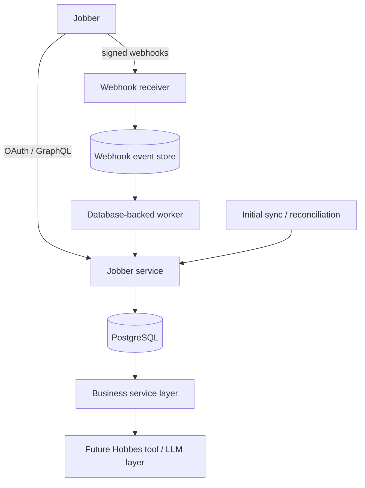

# Architecture

Hobbes is a read-focused, well-structured monolith. PostgreSQL is the durable boundary: analytics use the local normalized mirror, while synchronization uses Jobber as the authority. A future tool or LLM layer should call `BusinessService`, never SQL or GraphQL directly.

## Reliability model

* OAuth tokens are centralized in `jobber_connections`; refreshes are coalesced within a process and failed refreshes remove unusable credentials.
* Full syncs paginate each supported resource and use unique Jobber IDs plus SQL upserts.
* Webhook receipt verifies the HMAC over the unmodified bytes, inserts a delivery exactly once, and acknowledges before processing.
* The in-process worker claims durable events with `FOR UPDATE SKIP LOCKED`, retries with capped exponential delays, and runs an authoritative resource sync. This is deliberately less efficient than a per-object query, but avoids relying on webhook payloads and remains schema-simple.
* Reconciliation repeats a full upsert sync. It repairs updates and missing local rows. Hard-delete detection is not enabled because Jobber resource archival/deletion semantics must be confirmed per resource in the live schema.

## Boundaries and tradeoffs

There is one connection named `default`; no tenant framework or Redis is present. Public routes are health, OAuth, and signed webhook receipt. Business and sync routes require `X-Internal-Api-Key`. Token values are never included in logs. PostgreSQL connections use parameterized values; the only dynamic table/column identifiers come from a closed, code-owned allowlist.
